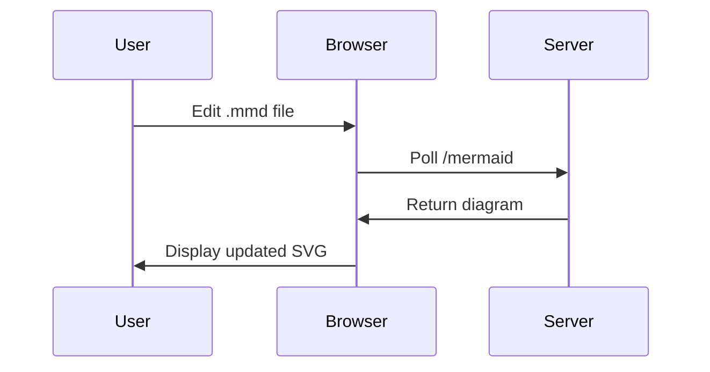
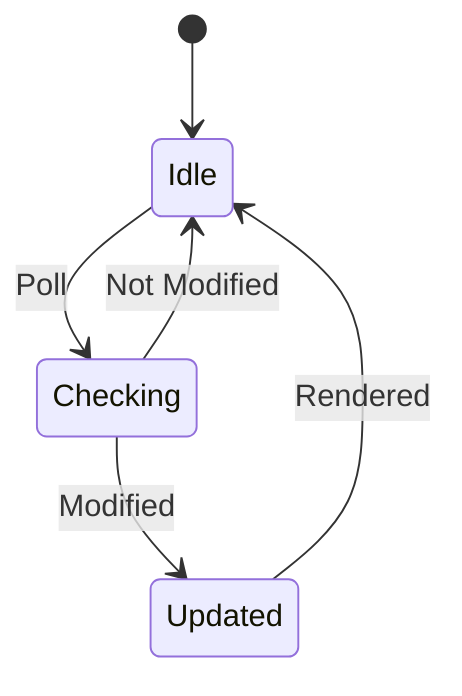

# Ariel

A quick and dirty Mermaid viewer diagram. Edit your Mermmaids diagram in Emacs, Vi, ... and see them change when you save.

## Features

- **Live Updates**: Automatically refreshes diagrams when `.mmd` files change
- **Client-Side Rendering**: Uses mermaid.js to render diagrams as SVG
- **Bootstrap UI**: Clean, responsive, minimal interface
- **See Errors**: Errors displayed in broweser
- **Auto-Open Browser**: Automatically opens your browser when it starts

## Quick Start

### 1. Setup Virtual Environment

```bash
# Create and activate virtual environment
python3 -m venv venv
source venv/bin/activate

# Install dependencies
pip install -r requirements.txt
```

### 2. Run the Server

```bash
# Using the startup script (auto-detects venv)
./start_ariel.sh diagram.mmd

# Or run directly with Python
python ariel.py diagram.mmd --port 5000
```

### 3. View in Browser

The browser will open automatically! If not, navigate to:
```
http://127.0.0.1:5000
```

### 4. Edit and Watch

Edit `diagram.mmd` in your favorite text editor and watch the diagram update automatically in your browser!

## Usage

### Basic Usage

```bash
# Start server to watch a file
./start_ariel.sh diagram.mmd
```

### Command Line Options

```bash
./start_ariel.sh FILE [OPTIONS]

ARGUMENTS:
  FILE                    Path to the .mmd file to watch (required)

OPTIONS:
  -h, --host HOST         Host to bind to (default: 127.0.0.1)
  -p, --port PORT         Port to bind to (default: 5000)
  -d, --debug             Enable debug mode
  --no-browser            Do not open browser automatically
  --help                  Show help message
```

### Examples

```bash
# Watch a specific file
./start_ariel.sh my_diagram.mmd

# Watch a specific file on custom port
./start_ariel.sh my_diagram.mmd -p 8080

# Enable debug mode
./start_ariel.sh diagram.mmd -d
```

### Running with Python Directly

```bash
# Activate virtual environment first
source venv/bin/activate

# Run the server
python ariel.py diagram.mmd

# Run with a different file
python ariel.py my_diagram.mmd

# With custom host and port
python ariel.py diagram.mmd --host 127.0.0.1 --port 5000

# Deactivate when done
deactivate
```

## How It Works

1. **Server watches** the `.mmd` file for modifications
2. **Browser polls** `/mermaid` endpoint every second with `If-Modified-Since` header
3. **Server returns**:
   - HTTP 304 if file unchanged (efficient caching)
   - New diagram content if file modified
4. **Browser renders** diagram using mermaid.js as SVG
5. **On errors**, displays checkerboard pattern and error message

## Example Diagrams

### Sequence Diagram


### State Diagram


## Files

- `ariel.py` - Flask web server
- `start_ariel.sh` - Bash startup script
- `templates/index.html` - Web interface template
- `diagram.mmd` - Sample Mermaid diagram
- `requirements.txt` - Python dependencies
- `.gitignore` - Git ignore rules

## Requirements

- Python 3.9+
- Flask 2.3.0+
- Werkzeug 2.3.0+

## Development

```bash
# Create virtual environment
python3 -m venv venv
source venv/bin/activate

# Install dependencies
pip install -r requirements.txt

# Run in debug mode
./start_ariel.sh -d

# Or
python ariel.py --debug
```

## License

MIT

## Contributing

Contributions welcome! Please feel free to submit a Pull Request.
